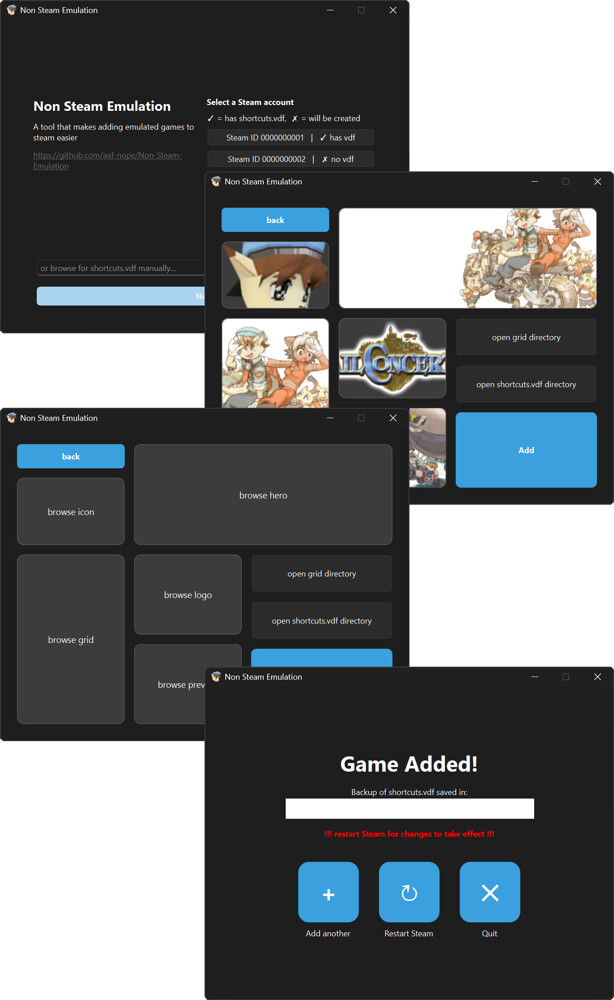
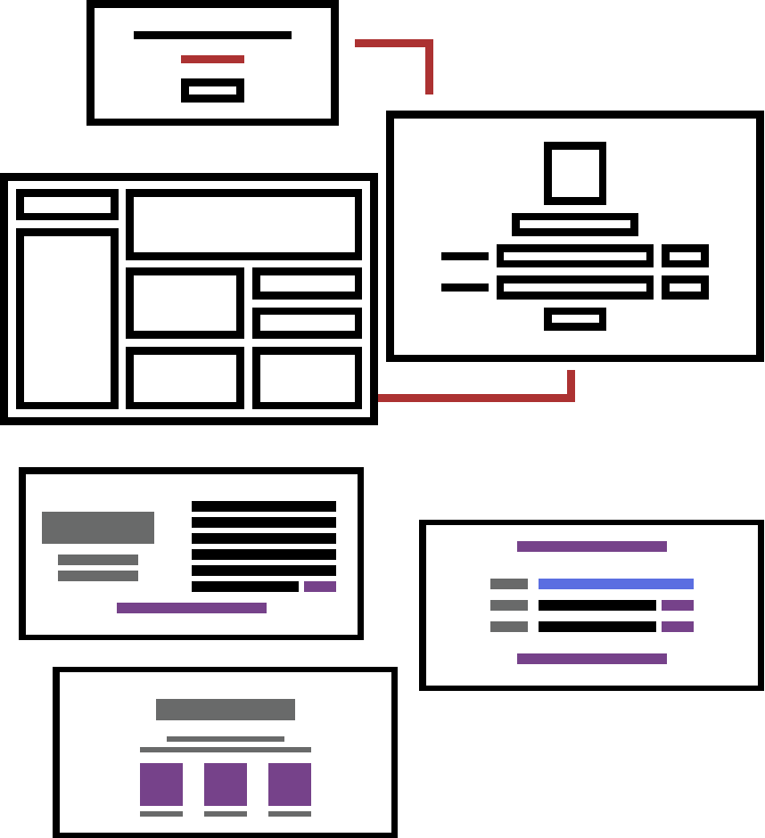

# Non-Steam-Emulation

A small Windows utility for adding emulated games to Steam as non-Steam games.

I built this project to automate the repetitive task of adding emulated games to Steam with launch commands. What started as a Python script is now a complete GUI application.

## Screenshots



*(Note: Older screenshots of previous releases can be found in the `Screenshots/` folder.)*

## Features

- Add emulated games to Steam as non-Steam shortcuts via a unified GUI
- Select emulator executable and game file easily
- Automatically build the emulator launch command and calculate the Steam App ID
- Add and modify `shortcuts.vdf` entries safely, parsing it as structured data
- Automatic `shortcuts.vdf` backups before changes
- Prompt for manual `shortcuts.vdf` location if automatic detection fails, and warn about corrupted files
- Add Steam library artwork (Grid, Hero, Logo, Preview, Icon)
- Open relevant Steam folders directly from the application
- Add multiple games quickly with a step-by-step workflow

## How It Works

The application operates on Steam's Windows userdata structure:

```text
C:\Program Files (x86)\Steam\userdata\<SteamID>\config\shortcuts.vdf
C:\Program Files (x86)\Steam\userdata\<SteamID>\config\grid\
```

The workflow:
1. Prompts the user for game name, emulator executable, game file, and optional artwork.
2. Builds the emulator launch command and calculates the Steam App ID.
3. Copies selected artwork to Steam's `grid` directory using the proper naming format.
4. Locates (or prompts for) `shortcuts.vdf` and verifies it's not corrupted or empty.
5. Loads `shortcuts.vdf` using the Python `vdf` package, treating it as structured KeyValues data rather than raw text for predictable editing.
6. Adds the new game, backs up the original `shortcuts.vdf`, and saves the updated file.

The implementation is based on Valve's documentation and community research into Steam's behavior. See [References](#references).

## Requirements

- **Packaged Release**: Windows, locally installed Steam (no Python required).
- **Source Code**: Python, PySide6, and the `vdf` package.

## Installation & Usage

**Packaged Version:** Run the included executable:
```powershell
.\GUI.exe
```

**From Source:**
```powershell
python GUI.py
```

## Project Structure

```text
Non-Steam-Emulation/
├── GUI.py                # Main application source
├── README.md
├── icon.ico
├── .gitignore
├── Screenshots/          # UI concepts and screenshots
└── LegacyScripts/        # Earlier development versions and experiments
```

The `LegacyScripts` directory contains earlier versions, preserving the project's evolution into the final GUI application.

## Development

This project evolved significantly over time:
- Started as a simple script experimenting with Steam's shortcut format.
- Adopted the Python `vdf` package to parse `shortcuts.vdf` as structured data instead of fragile raw text.
- Evolved into a complete PySide6 GUI application.
>- **Version 1.1.0 update:** Following a user issue, the `shortcuts.vdf` system was revamped and the GUI was completely redesigned. The app shifted to a single fixed-size window using `QStackedWidget` (merging the picker, paths, artwork, and completion screens), unified the UI with cyan-blue accents, improved inline error handling, and refined layout alignments.

## UI Design

The interface was planned out prior to implementation. The original and revised UI concepts:



The application was built closely around these designs.

## Testing

Extensively tested on Windows for:
- Creating shortcuts and successfully launching emulator commands
- Safely reading, modifying, and backing up `shortcuts.vdf` without losing existing data
- Accurate artwork placement in Steam directories
- Resiliency against missing or corrupted `shortcuts.vdf` files
- Smooth GUI workflow

## Limitations

- Windows only with locally installed Steam
- Exclusively designed for adding emulated games

## Planned Features

- Automatic game artwork fetching
- Custom launch options per shortcut

## References

Developed using official documentation and community resources:

- **Valve / Steam**: [Add Non-Steam Game](https://developer.valvesoftware.com/wiki/Add_Non-Steam_Game), [Steam Library Shortcuts](https://developer.valvesoftware.com/wiki/Steam_Library_Shortcuts), [KeyValues](https://developer.valvesoftware.com/wiki/KeyValues), [Steam Web API](https://steamcommunity.com/dev)
- **Python**: [vdf (PyPI)](https://pypi.org/project/vdf/), [`linecache`](https://docs.python.org/3/library/linecache.html), [`open()`](https://www.w3schools.com/PYTHON/ref_func_open.asp)
- **Community Research**: [ValveShortcuts (N0ine)](https://github.com/N0ine/ValveShortcuts), [Stack Exchange (Finding App ID)](https://gaming.stackexchange.com/questions/386882/how-do-i-find-the-appid-for-a-non-steam-game-on-steam)

## AI Assistance Disclosure

I developed the application's core logic, Steam integration, file handling, App ID logic, and UI design myself as a personal challenge. 
I intentionally avoided AI for the Python backend to test my own problem-solving skills.
AI (Claude) was only used to implement the PySide6 GUI layer based on my design requirements, which I then integrated and tested manually.

I fully recognize that using AI during development is normal and can be extremely useful, hell I even used AI while writing this very README, and I could have relied on it much more heavily to make the project easier or faster. Instead, I chose to treat this project as a test of my own programming ability and problem-solving skills. The result is something I can genuinely say I understand and built myself.
