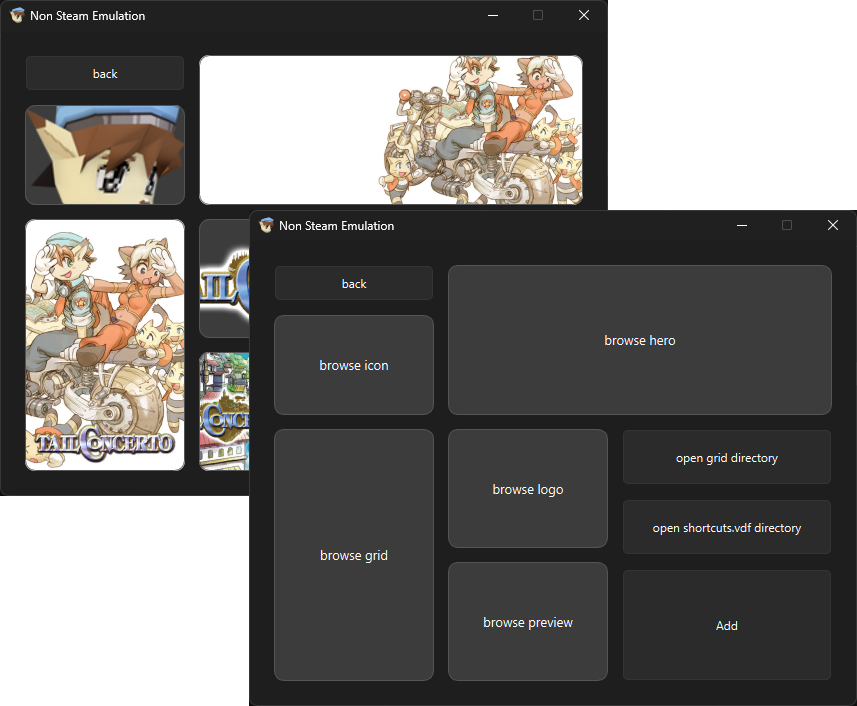
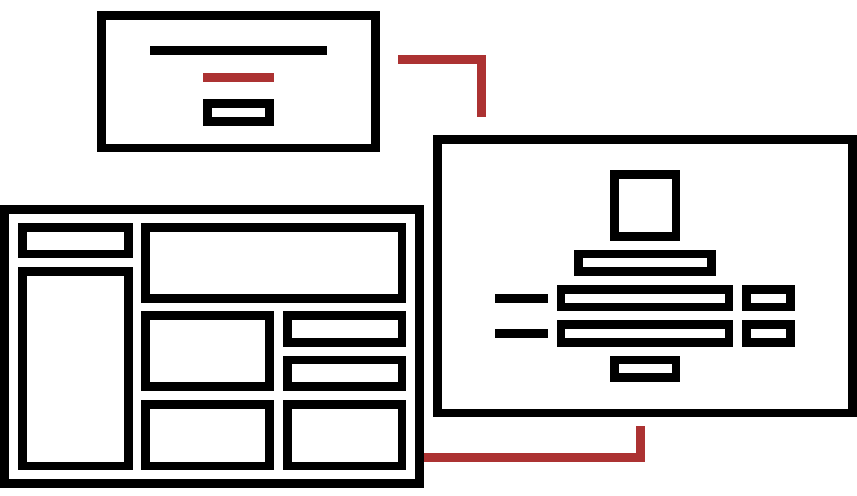

# Non-Steam-Emulation

A small Windows utility for adding emulated games to Steam as non-Steam games.

I built this project to solve a problem I kept running into: adding emulated games to Steam required repeatedly dealing with emulator launch commands by hand. What started as a simple Python script eventually became a complete GUI application.

## Screenshots



## Features

- Add emulated games to Steam as non-Steam shortcuts
- Select an emulator executable and game file through a GUI
- Automatically build the emulator launch command
- Calculate the Steam App ID used by the shortcut
- Add and modify entries in Steam's `shortcuts.vdf`
- Automatically back up `shortcuts.vdf` before making changes
- If `shortcuts.vdf` can't be found automatically, prompts you to manually enter its location
- Detects a corrupted or empty `shortcuts.vdf` and warns you instead of failing silently
- Add Steam library artwork, including:
  - Grid
  - Hero
  - Logo
  - Preview
  - Icon
- Open relevant Steam folders directly from the application
- Add multiple games through a simple step-by-step workflow

## How It Works

The application works with Steam's Windows userdata structure:

```text
C:\Program Files (x86)\Steam\userdata\<SteamID>\config\shortcuts.vdf
C:\Program Files (x86)\Steam\userdata\<SteamID>\config\grid\
```

The application asks the user for:

1. Game name
2. Emulator executable
3. Game file
4. Optional artwork

It then:

1. Builds the emulator launch command.
2. Calculates the App ID used for the Steam shortcut.
3. Copies the selected artwork into Steam's `grid` directory using the appropriate naming format.
4. Locates `shortcuts.vdf` automatically, or prompts for its location if it can't be found and checks that the file isn't corrupted or empty before proceeding.
5. Loads `shortcuts.vdf` as structured data using the Python `vdf` package.
6. Adds the new game to the existing `shortcuts` data.
7. Creates a backup of the original `shortcuts.vdf`.
8. Writes the updated data back to the file.

Rather than manipulating `shortcuts.vdf` as raw text, the application treats it as structured Valve KeyValues data. This was one of the important changes during development and made modifying existing shortcuts considerably more predictable.

The implementation is based on Valve's documentation together with community research into Steam's non-Steam shortcut and App ID behavior. See [References](#references).

## Requirements

### Released Version

- Windows
- Steam installed locally
- No Python installation required

The repository includes a packaged Windows executable.

### Running From Source

Python is required, along with:

- [PySide6](https://pypi.org/project/PySide6/)
- [vdf](https://pypi.org/project/vdf/)

## Installation / Running

### Packaged Version

Run the executable included with the release:

```powershell
.\GUI.exe
```

No Python installation is required for the packaged version.

### From Source

```powershell
python GUI.py
```

> **Important:** Steam should be closed while the application modifies `shortcuts.vdf`.

## Project Structure

```text
Non-Steam-Emulation/
│
├── GUI.py
├── README.md
├── icon.ico
├── .gitignore
│
├── Screenshots/
│   ├── Concept.png
│   └── screenshots.png
│
├── LegacyScripts/
│   ├── Main.py
│   └── ReadableFormatSlicing.py
│
└── ...
```

`GUI.py` contains the current application source code.

The `LegacyScripts` directory contains earlier versions and experiments from the development process. They're kept in the repository to preserve the project's evolution from the original scripts into the final GUI application.

## Development

The project developed through several stages.

It originally started as a simple script for experimenting with Steam's non-Steam shortcut format. As I learned more about how `shortcuts.vdf` worked, the implementation evolved into a more structured approach using the Python `vdf` package.

One of the important changes was moving away from treating `shortcuts.vdf` as raw text and instead loading it as structured data. This made it possible to modify existing shortcut information without relying on fragile string manipulation.

The project then evolved from command-line experimentation into the current PySide6 GUI application. The repository history contains the intermediate versions and experiments that led to the final implementation.

## UI Design

Before implementing the GUI, I designed the interface and workflow myself.

The original early concept is shown below:



The final application was then built around that design with a couple of tweaks.

## Testing

I tested the application on Windows using real Steam shortcut files, emulators, game files, and Steam library artwork.

Testing focused on:

- Creating non-Steam game entries
- Launching games through emulator commands
- Writing and reading `shortcuts.vdf`
- Preserving existing Steam shortcut data
- Creating backups before modifying the shortcut file
- Copying artwork into the correct Steam directories
- Handling missing, corrupted, or empty `shortcuts.vdf` files
- Handling the complete workflow through the GUI

## Limitations

- Windows only
- Assumes Steam is installed locally
- Designed around the standard Steam Windows userdata structure
- Steam should be closed while `shortcuts.vdf` is being modified
- The application focuses specifically on adding emulated games as Steam non-Steam shortcuts

## Planned Features

Things I'm planning to add going forward:

- Automatically fetching artwork for games instead of requiring manual selection
- Support for custom launch options per shortcut
- A button to restart Steam automatically, so you won't need to manually close it before editing and reopen it afterward

## References

The project was developed using a combination of official documentation, Python documentation, package documentation, and community + my own research.

### Valve / Steam

- [Valve Developer Wiki — Add Non-Steam Game](https://developer.valvesoftware.com/wiki/Add_Non-Steam_Game)
- [Valve Developer Wiki — Steam Library Shortcuts](https://developer.valvesoftware.com/wiki/Steam_Library_Shortcuts)
- [Valve Developer Wiki — KeyValues](https://developer.valvesoftware.com/wiki/KeyValues)
- [Steam Community — Steam Web API](https://steamcommunity.com/dev)

### Python

- [vdf — PyPI](https://pypi.org/project/vdf/)
- [Python — `linecache`](https://docs.python.org/3/library/linecache.html)
- [W3Schools — Python `open()`](https://www.w3schools.com/PYTHON/ref_func_open.asp)

### Community Research

- [N0ine — ValveShortcuts](https://github.com/N0ine/ValveShortcuts)
- [Stack Exchange — Finding the App ID for a Non-Steam Game](https://gaming.stackexchange.com/questions/386882/how-do-i-find-the-appid-for-a-non-steam-game-on-steam)
- I also used [Reddit](https://www.reddit.com/) and [Stack Overflow](https://stackoverflow.com/questions) for minor issues and problems

## AI Assistance

### This disclosure is included so that the development process and use of AI are transparent.

The application itself was developed by me, including the core Python logic, Steam integration, file handling, App ID generation, project structure, testing, and debugging.

I also designed the application's UI and workflow myself.

The only part where I used AI assistance was the PySide6 GUI implementation. I provided my own UI design and requirements to Claude and used its output to create the GUI layer because I did not have enough experience with PySide6 at the time and wanted to focus on completing the application rather than spending significant time learning the framework from scratch.

I then integrated that GUI with my existing application code myself and tested the complete application.

In short:

- **Application logic:** written by me
- **Steam integration:** written by me
- **File handling:** written by me
- **App ID logic:** written by me
- **UI design:** designed by me
- **GUI implementation:** AI-assisted
- **GUI integration:** done by me
- **Testing and debugging:** done by me

This project was also a personal challenge to myself. I intentionally avoided using AI to write the core Python code and logic because I wanted to prove to myself that I could take a problem, research it, work through the implementation, debug it, and build a functional Python application entirely on my own. I fully recognize that using AI during development is normal and can be extremely useful, hell I even used AI while writing this very README, and I could have relied on it much more heavily to make the project easier or faster. Instead, I chose to treat this project as a test of my own programming ability and problem-solving skills. The result is something I can genuinely say I understand and built myself.
